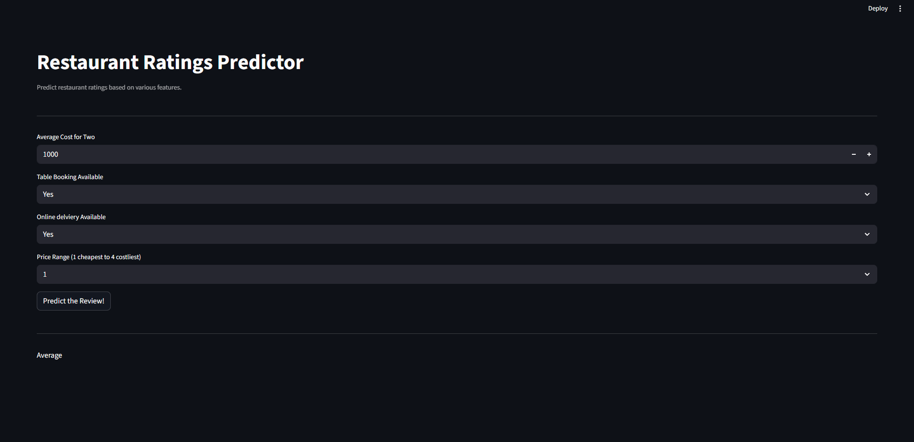

To try this project on your own computer:

Download or clone this folder.

Open a terminal inside the folder.

Run this command to install everything:

# pip install -r requirements.txt

Then start the app with:

# streamlit run app.py

That’s it! The app will open in your browser at http://localhost:8501.
